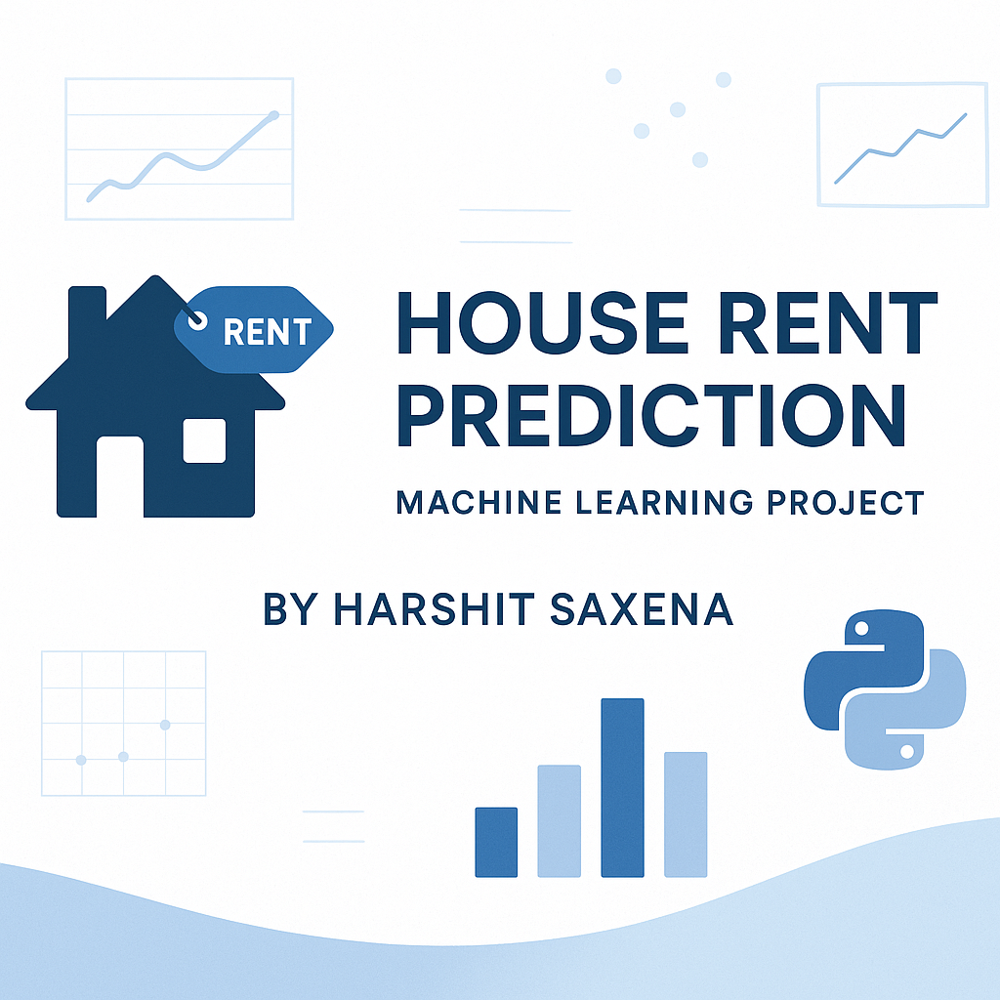

#  House Rent Prediction Model

A **Data Science project** to predict **house rental prices** based on multiple features such as size, city, furnishing status, and more.  
This project covers **data preprocessing**, **exploratory data analysis (EDA)**, and **model building** using **Linear Regression** and **Random Forest Regressor** in Python.

---

## 🟢 Live Demo

🔗 **Try it Live:** [Deployed App](house-rent-prediction-model.vercel.app/)  
📓 **Open in Google Colab:** [Run Notebook](https://colab.research.google.com/drive/15aoRSXB3AYjiAltyMKnInEmvF6sRA2OX#scrollTo=6b8d58a8)

---

## 📌 Project Objectives

- Predict rent prices based on various property features  
- Perform exploratory analysis to uncover insights from the dataset  
- Train and compare different regression models  
- Evaluate model performance using **R² Score** and **RMSE**

---

## 🔧 Tech Stack

- **Language**: Python  
- **Libraries**:
  - Pandas  
  - NumPy  
  - Matplotlib  
  - Seaborn  
  - Scikit-learn  

---

## 📊 Workflow Summary

1. **Data Preprocessing**  
   - Handling missing/null values  
   - Converting data types  
   - Encoding categorical variables  

2. **Exploratory Data Analysis (EDA)**  
   - Distribution plots  
   - Box plots & outlier detection  
   - Correlation heatmaps  

3. **Model Training & Evaluation**  
   - Linear Regression  
   - Random Forest Regressor  
   - Performance Metrics: R² Score, RMSE  

---

## 📁 Dataset

**File:** `house_rent_data.csv`  
Contains the following key features:
- Size (in BHK)  
- Rent (Target Variable)  
- Area Type  
- City  
- Furnishing Status  
- Tenant Type  
- Bathroom Count  

---

## ✅ Results

- Built and evaluated predictive models using **R² Score** and **RMSE**  
- **Random Forest** outperformed **Linear Regression** with higher accuracy  
- Extracted valuable insights on rental patterns by **city** and **furnishing status**  

---

## 👨‍💻 Author

**Harshit Saxena**  
B.Tech CSE | Maharaja Surajmal Institute of Technology, Delhi  

📧 [harshitsaxenavs@gmail.com](mailto:harshitsaxenavs@gmail.com)  
🌐 [LinkedIn](https://www.linkedin.com/in/harshit-saxena-vs/)  
💻 [GitHub](https://github.com/harshitsaxenavs)

---

## ⚠️ License

This project is **not open-source**.  
All rights are reserved by the author.  
Unauthorized copying, modification, or distribution is **strictly prohibited**.
